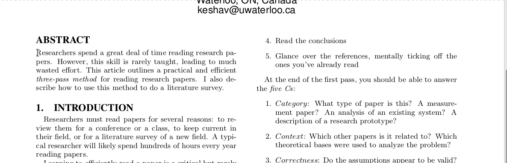

# CopyTrans

在Linux下复制文本并翻译，以系统通知显示翻译结果。

## 效果


## 安装
安装xsel或xclip
```bash
sudo apt install xsel xclip
```
安装[notify-send](https://github.com/vlevit/notify-send.sh)
```bash
sudo apt install notify-send
```
安装 [translate-shell](https://github.com/soimort/translate-shell)


新建copytrans.sh文件，将以下代码复制进copytrans.sh中。

```bash
#!/usr/bin/env bash

# Need https://github.com/soimort/translate-shell installed.
# Need xsel or xclip installed.
# Need notify-send installed.

se=$(xsel -b -n -o | tr '\n' ' '| tr '\r' ' ' | sed 's/  / /g') # xclip -selection clipboard -o
echo $se
re=$(/home/xuewei/bin/CopyTranslator/trans -b en:zh "$se")
echo $re
notify-send "$se" "$re" -i accessories-dictionary -t 2000
```

```bash
chmod a+x copytrans.sh
```

然后在系统快捷键设置中添加执行此脚本的快捷键。


## 使用

选中词或句子，按Ctrl+C复制，按设定的快捷键运行翻译脚本显示翻译。
